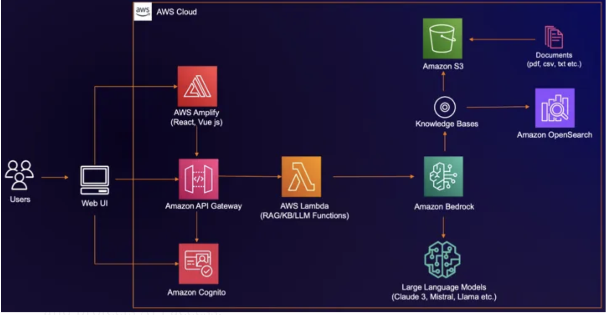

# Cloud-Engineers-AI-Challenge
## Agricultural AI Agent ##
Basic premise
In this world there is a heap of people who want to do good. I am one of them. Coming from a farming background (my parents are Central Otago, New Zealand, High Country merino sheep farmers), I have seen the struggles of farmers and the agricultural sector.

I have also seen the power of AI and machine learning in the agricultural sector and want to harness these powerful tools to help the community I grew up in.

To do this, I joined an AI Challenge from Cloud Engineers, an online community with Fernando Goncalves at the helm, to build a chatbot using Amazon Bedrock and other AWS Services such as S3, API Gateway, DynamoDB and Lambda.

The challenge was quite open ended- build a chatbot using Amazon Bedrock and other AWS Services on a subject of your choice.

I had thought about various things relating to the farming industry, like water usage, crop yeild patterns, weather forecasting, etc or the use of IoT devices to monitor soil moisture, water usage, etc. but I decided to go with a different subject where I could leverage a dataset from Kaggle and I didn't have the added complexity of calibrating the monitors as well.

https://www.kaggle.com/datasets/suvroo/ai-for-sustainable-agriculture-dataset/data

I had the data and now I needed the architecture. I found a great article on how to build a chatbot using Amazon Bedrock and other AWS Services on a subject of your choice. I used this as a starting point and modified it to suit my needs.

https://medium.com/@ajaypan2/building-a-serverless-chatbot-on-aws-with-amazon-bedrock-a-real-world-rag-use-case-a521a0fcc0b5

AWS also has a vast amount of help in their solutions library, architecture centre and workshops.

From the solutions library: https://aws.amazon.com/solutions/guidance/building-custom-chatbots-for-order-recommendations-using-agents-for-amazon-bedrock/?did=sl_card&trk=sl_card

This workshop is related to the project so I have used this a part of my research into designing and production of the chatbot.

https://catalog.us-east-1.prod.workshops.aws/workshops/f5a3879d-086a-4873-b16f-bd4caf5c1623/en-US

